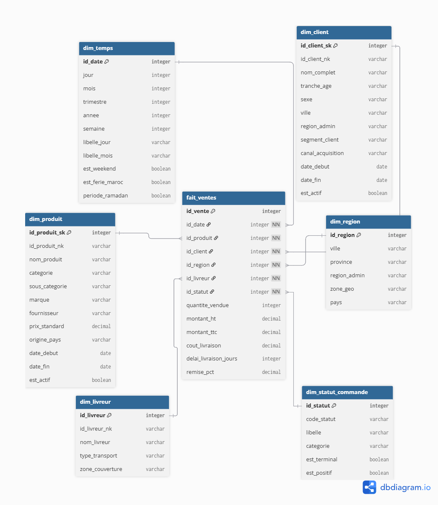

# Data Warehouse Modelling
## Mexora Analytics — Design Justification Document
 
**Students:** Matthews Lungu & Adjii Charles

---

## 1.2 Star Schema Design

### Entity-Relationship Diagram
The schema follows a classic star design with:
- 1 central fact table: FAIT_VENTES (49,567 rows)
- 6 surrounding dimension tables
- All joins use integer surrogate keys for performance
- Indexes on all foreign key columns in FAIT_VENTES
- 3 materialized views in reporting_mexora schema for
 dashboard performance

*Generated using dbdiagram.io — full diagram available at the GitHub repository.*

### Fact Table — FAIT_VENTES

#### Granularity

> The chosen granularity for fait_ventes is: one row represents one individual order line placed by one client, for one product, delivered to one region, by one delivery driver, on one specific day, with one order status. This is the finest possible granularity available in Mexora's transactional data.

It was chosen for the following reason:

>The architecture prioritizes analytical flexibility. By capturing data at the atomic transaction level rather than pre-aggregated monthly totals, the system empowers stakeholders to perform deep-dive root cause analysis. This ensures that performance trends in Tangier can be sliced simultaneously by specific customer profiles and product categories without data loss.

---

#### Measures and Additivity

| Measure | Aggregation | Additivity Type | Justification |
|---|---|---|---|
| `montant_ttc` | SUM | **Additive** | Revenue sums correctly across all dimensions — region, month, product, client |
| `montant_ht` | SUM | **Additive** | Pre-tax revenue — summable at all granularities |
| `quantite_vendue` | SUM | **Additive** | Total units sold — sums meaningfully across every dimension |
| `cout_livraison` | SUM | **Additive** | Total delivery cost — sums by driver, region, period |
| `delai_livraison_jours` | AVERAGE | **Semi-additive** | Averaging delivery days is meaningful; summing is not |
| `remise_pct` | AVERAGE | **Non-additive** | A percentage — summing discount rates produces a meaningless number |

---

#### DIM_STATUT_COMMANDE — 6th Dimension (Design Choice)

> Extracting `statut_commande`  into a proper dimension adds two analytical boolean flags (`est_positif`, `est_terminal`). The inclusion of this dimension serves as a strategic "Behind the Scenes" layer that ensures Schema Extensibility and data integrity. By isolating order states (e.g., Pending, Delivered, Cancelled) into a dedicated dimension, the model remains future-proofed against changes in business logic without requiring a refactor of the central fact table. Furthermore, it enables pre-emptive modeling by using boolean flags like est_positif to simplify complex DAX logic, allowing the system to scale effortlessly as Mexora's analytical needs grow beyond basic revenue tracking.

---

## 1.3 Slowly Changing Dimensions (SCD)

### SCD Case 1 — DIM_PRODUIT (Type 2)

> In January 2025, Mexora restructures its product catalogue and moves the Tablette Samsung Galaxy A9 from the broad "Electronique" category to a more specific "Tablettes" subcategory as the range grows. 

**Justification:**We choose SCD Type 2 because sales made before January 2025 must remain classified under "Electronique" for accurate year-over-year category trend analysis. Overwriting the category (Type 1) would corrupt historical reporting — Q3 2023 revenue would suddenly appear under "Tablettes" even though that category didn't exist at the time of purchase.*

---

### SCD Case 2 — DIM_CLIENT (Type 1)

> A customer moves from Bronze to Gold segment
as their 12-month revenue crosses the 15,000 MAD threshold.

**Justification:** For customer segmentation, we want the
current segment to be used for all analysis. The CEO's
question "which segment has the highest basket?" refers
to current segmentation. Tracking historical segment
changes would add complexity without analytical value
for this use case. A Type 1 overwrite is appropriate —
the old value is simply replaced with the new segment.

*The segment_client column in dim_client
is recalculated on every ETL run based on the last 12
months of delivered orders. No history is preserved.*

